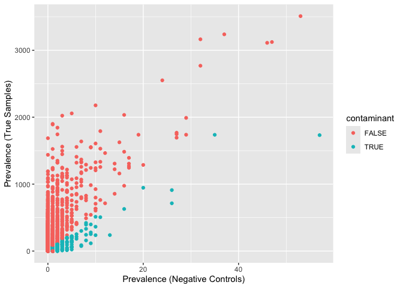

01-remove-contaminants
================
desantiago
2024-07-25

## Filter out contaminatns using Decontam’s prevelance method. For more information see <https://github.com/benjjneb/decontam>

### First we want to identify the contaminant ASVs in this dataset

set the prevalence theshold to to stricter value (0.5) for more
information on paramters see the decontam manual

``` r
sample_data(phylo_object_tree)$is.neg <- sample_data(phylo_object_tree)$sample_control == "control" # create a sample-variable for contaminants
phylo_object_contaminants <- isContaminant(phylo_object_tree, method = "prevalence", neg="is.neg", threshold=0.5, detailed = TRUE, normalize = TRUE) # detect contaminants based on control samples and their ASV prevalance
table(phylo_object_contaminants$contaminant) # check number of ASVs that are contaminents
```

    ## 
    ##  FALSE   TRUE 
    ## 190197    632

### Make presence-absence table of the contaminants in controls and samples

``` r
# Make phyloseq object of presence-absence in negative controls and true samples
phylo_object_contaminants.pa <- transform_sample_counts(phylo_object_tree, function(abund) 1 * (abund > 0)) # convert phyloseq table to presence-absence
ps.pa.neg <- prune_samples(sample_data(phylo_object_contaminants.pa)$sample_control == "control", phylo_object_contaminants.pa) # identify controls
ps.pa.pos <- prune_samples(sample_data(phylo_object_contaminants.pa)$sample_control == "true_sample", phylo_object_contaminants.pa) # identify samples
df.pa <- data.frame(pa.pos=taxa_sums(ps.pa.pos), pa.neg=taxa_sums(ps.pa.neg), contaminant=phylo_object_contaminants$contaminant) # convert into a dataframe
```

### Plot contamination in the dataset

we see a clear split between prevalence in true samples vs controls we
can be sure that we remove most of the contaminants

``` r
# Make phyloseq object of presence-absence in negative controls and true samples
ggplot(data=df.pa, aes(x=pa.neg, y=pa.pos, color=contaminant)) + geom_point() + xlab("Prevalence (Negative Controls)") + ylab("Prevalence (True Samples)")
```

<!-- -->

### Filter out decontaminants

remove the contaminant ASVs and filter out rare taxa (ASVs with less
than 5 reads in each sample) since we already used the controls to find
and remove contaminants we will remove them from the dataset

``` r
phylo_obj_tree_sans_contam <- prune_taxa(!phylo_object_contaminants$contaminant, phylo_object_tree) # remove ASVs identified as decontaminants from the dataset
phylo_obj_tree_sans_contam_low <- filter_taxa(phylo_obj_tree_sans_contam, function(x) sum(x > 5) > 1, TRUE) # remove ASVs that are rare in each sample 
phylo_obj_tree_sans_contam_low_controls <- subset_samples(phylo_obj_tree_sans_contam_low, region != "kitblank" & region!= "negativecontrol" & region != "positivecontrol") ## Remove blanks and positive controls
phylo_obj_tree_sans_contam_low_controls
```

    ## phyloseq-class experiment-level object
    ## otu_table()   OTU Table:         [ 42455 taxa and 4095 samples ]
    ## sample_data() Sample Data:       [ 4095 samples by 54 sample variables ]
    ## tax_table()   Taxonomy Table:    [ 42455 taxa by 24 taxonomic ranks ]
    ## phy_tree()    Phylogenetic Tree: [ 42455 tips and 42385 internal nodes ]
