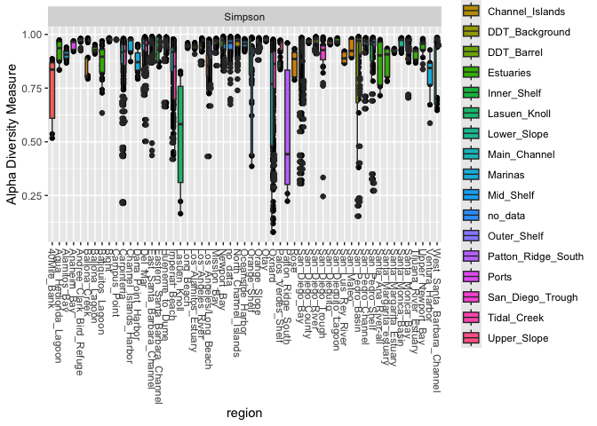

01-alpha-diversity
================
desantiago
2024-06-04

## Plot Alpha Diversity (Observed ASVs)

Phyloseq uses ggplot to make publication ready figures

``` r
plot_richness(phylo_obj_tree_sans_contam_low_controls, x = "region", measures = c("Observed")) +
  geom_boxplot(aes(fill = habitat)) 
```


``` r
#  facet_wrap(habitat ~ ., scales = "free", drop = TRUE, ncol = 2, shrink = T) +
#  theme_bw() +
#  theme(axis.text.x = element_text(angle = 90))
```

## Plot Alpha Diversity (Shannon)

``` r
plot_richness(phylo_obj_tree_sans_contam_low_controls, x = "region", measures = c("Shannon")) +
  geom_boxplot(aes(fill = habitat)) 
```


``` r
#  facet_wrap(SampleType ~ ., scales = "free", drop = TRUE, ncol = 2, shrink = T) +
#  theme_bw() +
#  theme(axis.text.x = element_text(angle = 90))
```

## Plot Alpha Diversity (Simpson)

``` r
plot_richness(phylo_obj_tree_sans_contam_low_controls, x = "region", measures = c("Simpson")) +
  geom_boxplot(aes(fill = habitat))
```



``` r
#  facet_wrap(SampleType ~ ., scales = "free", drop = TRUE, ncol = 2, shrink = T) +
#  theme_bw() +
#  theme(axis.text.x = element_text(angle = 90))
```
